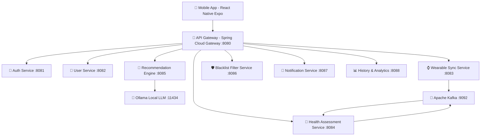

# 📱 Adaptive AI-Powered Diet & Workout Recommendation System

Hệ thống cá nhân hóa thực đơn ăn uống và bài tập luyện tập thể thao dựa trên **chỉ số mệt mỏi/phục hồi (FRI - Fatigue Recovery Index)** và **Trí tuệ nhân tạo (Ollama LLM)**.

Hệ thống được thiết kế theo kiến trúc **Microservices Monorepo** chuẩn doanh nghiệp với Backend Java 21 Spring Boot và Mobile App React Native Expo.

---

## 🏗️ Kiến Trúc Hệ Thống



---

## 🛠️ Yêu Cầu Môi Trường (Prerequisites)

Trước khi bắt đầu, hãy đảm bảo máy tính của bạn đã cài đặt các công cụ sau:

1. **Java JDK 21** trở lên (`java -version`)
2. **Apache Maven 3.8+** (`mvn -version`)
3. **Node.js (v18+) & npm** (`node -v`, `npm -v`)
4. **Docker Desktop & Docker Compose** (`docker -v`, `docker-compose -v`)
5. **Ollama** (Nếu muốn chạy LLM local) (`ollama -v`)

---

## 🚀 Hướng Dẫn Khởi Chạy Hệ Thống

### Bước 1: Clone Repository

```bash
git clone https://github.com/DinhPhat1401/prj-mss.git
cd prj-mss
```

---

### Bước 2: Khởi Chạy Hạ Tầng Database & Message Bus

Mở Terminal và di chuyển vào thư mục `infrastructure` để khởi chạy PostgreSQL, Redis, Apache Kafka và Ollama:

```bash
cd infrastructure
docker-compose up -d
```

Kiểm tra trạng thái các container đang chạy:
```bash
docker ps
```

*Các dịch vụ hạ tầng sẽ hoạt động tại:*
- **PostgreSQL**: `localhost:5432` (User: `mss_user`, Pass: `mss_password`, DB: `mss_db`)
- **Redis**: `localhost:6379`
- **Apache Kafka**: `localhost:9092`
- **Ollama LLM**: `localhost:11434`

---

### Bước 3: Tải Model Cho Ollama AI (Tùy chọn)

Nếu bạn chạy Ollama trong Docker container hoặc máy local, tải model `llama3` hoặc `qwen2.5`:

```bash
# Nếu chạy qua Docker:
docker exec -it mss_ollama ollama run llama3

# Nếu chạy Ollama trực tiếp trên máy:
ollama run llama3
```

---

### Bước 4: Khởi Chạy Backend Microservices

Mở các cửa sổ Terminal riêng biệt cho từng service trong thư mục `services/` (hoặc chạy service bạn cần test):

#### 1. API Gateway (Cổng chính :8080)
```bash
cd services/api-gateway
mvn spring-boot:run
```

#### 2. Auth Service (:8081)
```bash
cd services/auth-service
mvn spring-boot:run
```

#### 3. User Service (:8082)
```bash
cd services/user-service
mvn spring-boot:run
```

#### 4. Wearable Sync Service (:8083)
```bash
cd services/wearable-sync-service
mvn spring-boot:run
```

#### 5. Health Assessment Service (:8084)
```bash
cd services/health-assessment-service
mvn spring-boot:run
```

#### 6. Recommendation Engine Service (:8085)
```bash
cd services/recommendation-service
mvn spring-boot:run
```

#### 7. Blacklist Filter Service (:8086)
```bash
cd services/blacklist-filter-service
mvn spring-boot:run
```

#### 8. Notification Service (:8087)
```bash
cd services/notification-service
mvn spring-boot:run
```

#### 9. History Service (:8088)
```bash
cd services/history-service
mvn spring-boot:run
```

---

### Bước 5: Khởi Chạy Mobile Application (React Native Expo)

1. Di chuyển vào thư mục `mobile/adaptive-health-app`:
```bash
cd mobile/adaptive-health-app
```

2. Cài đặt các thư viện phụ thuộc:
```bash
npm install
```

3. Khởi chạy Expo Dev Server:
```bash
npx expo start
```

4. Trải nghiệm ứng dụng:
   - Nhấn **`a`** để mở trên Android Emulator.
   - Nhấn **`i`** để mở trên iOS Simulator.
   - Nhấn **`w`** để mở trên Trình duyệt Web.
   - Quét mã QR bằng ứng dụng **Expo Go** trên điện thoại thật.

---

## 🔌 Danh Sách Port & Endpoints Microservices

| Service | Port | Base Path qua API Gateway (`localhost:8080`) |
|---|---|---|
| **API Gateway** | `8080` | `http://localhost:8080` |
| **Auth Service** | `8081` | `http://localhost:8080/api/v1/auth` |
| **User Service** | `8082` | `http://localhost:8080/api/v1/users` |
| **Wearable Sync Service** | `8083` | `http://localhost:8080/api/v1/wearable` |
| **Health Assessment Service** | `8084` | `http://localhost:8080/api/v1/health` |
| **Recommendation Engine** | `8085` | `http://localhost:8080/api/v1/recommendation` |
| **Blacklist Filter Service** | `8086` | `http://localhost:8080/api/v1/blacklist` |
| **Notification Service** | `8087` | `http://localhost:8080/api/v1/notifications` |
| **History & Analytics Service** | `8088` | `http://localhost:8080/api/v1/history` |

---

## 🧪 Kiểm Thử API (Ví dụ cURL)

### 1. Đăng ký tài khoản (`auth-service`)
```bash
curl -X POST http://localhost:8080/api/v1/auth/register \
  -H "Content-Type: application/json" \
  -d '{"email":"user@example.com","password":"password123","fullName":"Nguyễn Văn A"}'
```

### 2. Tạo hồ sơ người dùng (`user-service`)
```bash
curl -X POST http://localhost:8080/api/v1/users/profile \
  -H "Content-Type: application/json" \
  -d '{"userId":"YOUR_USER_ID","age":25,"gender":"MALE","heightCm":175,"weightKg":70,"fitnessGoal":"LOSE_WEIGHT","activityLevel":"MODERATELY_ACTIVE"}'
```

### 3. Tính toán chỉ số mệt mỏi FRI (`health-assessment-service`)
```bash
curl -X POST "http://localhost:8080/api/v1/health/assess/YOUR_USER_ID?currentRHR=72&baseRHR=65&sleepHours=7.5"
```

### 4. Gọi AI sinh thực đơn & bài tập (`recommendation-service`)
```bash
curl -X POST http://localhost:8080/api/v1/recommendation/generate \
  -H "Content-Type: application/json" \
  -d '{"userId":"YOUR_USER_ID","targetCalories":2000,"fitnessGoal":"LOSE_WEIGHT","friScore":85,"healthStatus":"NORMAL","alphaIntensity":1.0,"blacklist":["tôm","cần tây"]}'
```

---

## 📁 Cấu Trúc Monorepo Dự Án

```
adaptive-health-system/
├── services/                         # Java 21 Spring Boot Microservices
│   ├── api-gateway/                  # Spring Cloud Gateway (:8080)
│   ├── auth-service/                 # Auth & JWT (:8081)
│   ├── user-service/                 # User Profile & BMR (:8082)
│   ├── wearable-sync-service/        # Apple/Google Fit Sync (:8083)
│   ├── health-assessment-service/    # FRI Calculator (:8084)
│   ├── recommendation-service/       # Ollama LLM Engine (:8085)
│   ├── blacklist-filter-service/     # Food Blacklist & Macro Loss (:8086)
│   ├── notification-service/         # FCM Push Notification (:8087)
│   └── history-service/              # TimescaleDB History (:8088)
├── mobile/
│   └── adaptive-health-app/          # React Native Expo (16 Screens)
├── infrastructure/
│   └── docker-compose.yml            # PostgreSQL, Redis, Kafka, Ollama
├── development_plan.md               # Lộ trình phát triển chi tiết
└── README.md                         # Hướng dẫn chạy dự án
```
