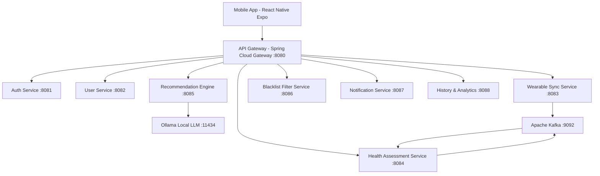

# Adaptive AI-Powered Diet & Workout Recommendation System

Adaptive Health System là nền tảng hỗ trợ cá nhân hóa chế độ dinh dưỡng và lộ trình luyện tập thể thao thông minh. Hệ thống tự động điều chỉnh theo trạng thái thể chất thực tế của người dùng dựa trên chỉ số mệt mỏi & phục hồi (Fatigue Recovery Index - FRI) kết hợp với mô hình Trí tuệ nhân tạo (Ollama Local LLM).

---

## 1. Giới Thiệu Chức Năng Nổi Bật

### 1.1. Đánh Giá Trạng Thái Thể Chất Thông Minh (FRI Algorithm)
- Phân tích nhịp tim lúc nghỉ (Resting Heart Rate - RHR) trung bình 7 ngày và chất lượng giấc ngủ để tính toán chỉ số mệt mỏi & phục hồi (Fatigue Recovery Index - FRI).
- Phân loại trạng thái thể chất thành các nhóm: *Fatigue (Mệt mỏi)*, *Normal (Cân bằng)*, và *Peak Recovery (Phục hồi đỉnh cao)*.
- Tự động điều chỉnh hệ số cường độ $\alpha(t)$ từ `0.6` đến `1.2` để tối ưu hóa khối lượng vận động và thực đơn dinh dưỡng tương ứng.

### 1.2. Khung AI Gợi Ý Thực Đơn & Giáo Án Bài Tập (Ollama LLM Engine)
- Tích hợp cục bộ mô hình ngôn ngữ lớn (Ollama LLM) để sinh câu trả lời cá nhân hóa theo thời gian thực mà vẫn đảm bảo tính riêng tư dữ liệu.
- Xây dựng Context Prompt động kết hợp chỉ số BMR/TDEE (Mifflin-St Jeor), mục tiêu thể hình (tăng/giảm/giữ cân), trạng thái FRI và danh sách thực phẩm cấm.
- Áp dụng lớp kiểm soát Schema Guardrail nghiêm ngặt, bắt buộc định dạng phản hồi chuẩn JSON cho ứng dụng di động.

### 1.3. Hệ Thống Lọc & Thay Thế Thực Phẩm Vi Phạm (Blacklist Guardrail & Food Replacement)
- Cam kết tỷ lệ vi phạm blacklist thực phẩm và dị ứng = **0%**.
- Tự động kiểm tra thực đơn trước khi hiển thị cho người dùng.
- Thuật toán thay thế thực phẩm thông minh tự động tìm kiếm món ăn tương đương $f'_i$ nhằm tối thiểu hóa sai lệch giá trị dinh dưỡng (Macronutrient Loss Function):
$$\text{Loss}(f_i, f'_i) = w_p \cdot (P_{f_i} - P_{f'_i})^2 + w_c \cdot (C_{f_i} - C_{f'_i})^2 + w_f \cdot (F_{f_i} - F_{f'_i})^2$$

### 1.4. Xử Lý Dữ Liệu Sự Kiện Real-time (Wearable Sync & Kafka Event-Driven)
- Chuẩn hóa và đồng bộ dữ liệu sức khỏe từ Apple HealthKit, Google Fit REST API hoặc dữ liệu nhập thủ công.
- Loại bỏ dữ liệu trùng lặp (deduplication) và phát sự kiện `wearable.data.synced` qua Apache Kafka Message Bus để các dịch vụ xử lý bất đồng bộ.

### 1.5. Ứng Dụng Di Động Đa Nền Tảng (Cross-Platform Mobile Application)
- Phát triển trên nền tảng React Native (Expo SDK 51 + TypeScript) với 16 màn hình chức năng chuyên nghiệp.
- Hỗ trợ giao diện tối (Dark Mode UI), hiển thị biểu đồ tiến trình, xem lại lịch sử gợi ý theo thời gian và cài đặt thông báo nhắc nhở thông minh.

---

## 2. Kiến Trúc Hệ Thống



### Danh Sách Các Dịch Vụ Backend Microservices (Java 21 Spring Boot + Maven)

| # | Dịch Vụ | Port | Vai Trò Chính |
|---|---|---|---|
| 1 | **API Gateway** | `8080` | Định tuyến request, JWT Validation filter và Rate limiting |
| 2 | **Auth Service** | `8081` | Đăng ký, đăng nhập, OAuth2 Google Sign-in và Refresh Token Rotation |
| 3 | **User Service** | `8082` | Quản lý hồ sơ người dùng, tính chỉ số BMR (Mifflin-St Jeor) và TDEE |
| 4 | **Wearable Sync Service** | `8083` | Đồng bộ dữ liệu Apple Health/Google Fit, Publish Kafka event `wearable.data.synced` |
| 5 | **Health Assessment Service** | `8084` | Tính toán chỉ số FRI, RHR Baseline 7 ngày, Publish Kafka event `health.status.updated` |
| 6 | **Recommendation Engine Service** | `8085` | Xây dựng Prompt, tích hợp Ollama WebClient LLM Engine và Redis Cache |
| 7 | **Blacklist Filter Service** | `8086` | Quản lý Blacklist/Dị ứng, Meal Validation và Thuật toán thay thế thực phẩm |
| 8 | **Notification Service** | `8087` | Gửi thông báo Push qua Firebase FCM và lên lịch nhắc nhở |
| 9 | **History & Analytics Service** | `8088` | Lưu trữ lịch sử gợi ý thực đơn, bài tập và thống kê tiến trình |

---

## 3. Hướng Dẫn Khởi Chạy Hệ Thống

### 3.1. Yêu Cầu Môi Trường (Prerequisites)
- **Java JDK 21 LTS** (`java -version`)
- **Apache Maven 3.8+** (`mvn -version`)
- **Node.js v18+ & npm** (`node -v`, `npm -v`)
- **Docker & Docker Compose** (`docker -v`, `docker-compose -v`)
- **Ollama** (`ollama -v`)

---

### 3.2. Quy Trình Khởi Chạy Từng Bước

#### Bước 1: Clone Repository
```bash
git clone https://github.com/DinhPhat1401/prj-mss.git
cd prj-mss
```

#### Bước 2: Khởi Chạy Dịch Vụ Hạ Tầng (Docker Container)
Di chuyển vào thư mục `infrastructure` và chạy lệnh:
```bash
cd infrastructure
docker-compose up -d
```
*Các dịch vụ hạ tầng sẽ sẵn sàng tại:*
- PostgreSQL: `localhost:5432`
- Redis: `localhost:6379`
- Apache Kafka: `localhost:9092`
- Ollama Container: `localhost:11434`

#### Bước 3: Tải Model Cho Ollama LLM Engine
```bash
docker exec -it mss_ollama ollama run llama3
```

#### Bước 4: Khởi Chạy Các Microservices Backend
Mở Terminal riêng cho từng dịch vụ trong thư mục `services/`:

```bash
# Khởi chạy API Gateway (Port 8080)
cd services/api-gateway
mvn spring-boot:run

# Khởi chạy Auth Service (Port 8081)
cd services/auth-service
mvn spring-boot:run

# Khởi chạy User Service (Port 8082)
cd services/user-service
mvn spring-boot:run

# Khởi chạy Wearable Sync Service (Port 8083)
cd services/wearable-sync-service
mvn spring-boot:run

# Khởi chạy Health Assessment Service (Port 8084)
cd services/health-assessment-service
mvn spring-boot:run

# Khởi chạy Recommendation Engine Service (Port 8085)
cd services/recommendation-service
mvn spring-boot:run

# Khởi chạy Blacklist Filter Service (Port 8086)
cd services/blacklist-filter-service
mvn spring-boot:run

# Khởi chạy Notification Service (Port 8087)
cd services/notification-service
mvn spring-boot:run

# Khởi chạy History Service (Port 8088)
cd services/history-service
mvn spring-boot:run
```

#### Bước 5: Khởi Chạy Mobile Application
1. Di chuyển vào thư mục ứng dụng di động:
```bash
cd mobile/adaptive-health-app
```
2. Cài đặt các thư viện phụ thuộc:
```bash
npm install
```
3. Khởi chạy Expo Dev Server:
```bash
npx expo start
```
- Nhấn **`a`** để mở trên Android Emulator.
- Nhấn **`i`** để mở trên iOS Simulator.
- Nhấn **`w`** để chạy trên Trình duyệt Web.
- Quét mã QR bằng ứng dụng **Expo Go** trên thiết bị thật.

---

## 4. Kiểm Thử API Trực Tiếp (cURL Examples)

### 4.1. Đăng ký tài khoản người dùng
```bash
curl -X POST http://localhost:8080/api/v1/auth/register \
  -H "Content-Type: application/json" \
  -d '{"email":"user@example.com","password":"password123","fullName":"Nguyễn Văn A"}'
```

### 4.2. Khởi tạo hồ sơ & tính toán BMR/TDEE
```bash
curl -X POST http://localhost:8080/api/v1/users/profile \
  -H "Content-Type: application/json" \
  -d '{"userId":"YOUR_USER_ID","age":25,"gender":"MALE","heightCm":175,"weightKg":70,"fitnessGoal":"LOSE_WEIGHT","activityLevel":"MODERATELY_ACTIVE"}'
```

### 4.3. Đánh giá trạng thái thể chất FRI
```bash
curl -X POST "http://localhost:8080/api/v1/health/assess/YOUR_USER_ID?currentRHR=72&baseRHR=65&sleepHours=7.5"
```

### 4.4. Yêu cầu AI sinh thực đơn & giáo án bài tập
```bash
curl -X POST http://localhost:8080/api/v1/recommendation/generate \
  -H "Content-Type: application/json" \
  -d '{"userId":"YOUR_USER_ID","targetCalories":2000,"fitnessGoal":"LOSE_WEIGHT","friScore":85,"healthStatus":"NORMAL","alphaIntensity":1.0,"blacklist":["tôm","cần tây"]}'
```
