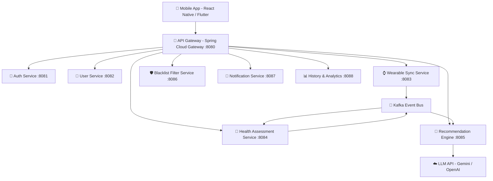

# 📋 Kế Hoạch Phát Triển Hệ Thống
## Adaptive AI-Powered Diet & Workout Recommendation System
### Mobile App + Java Spring Boot Microservices Backend

---

## 🏗️ Tổng Quan Kiến Trúc Hệ Thống



---

## 📱 Phần 1: Mobile Application (16 Màn hình)

| # | Màn hình / Tính năng | Mô tả | Ưu tiên | Sprint |
|---|---|---|---|---|
| 1 | **Onboarding & Đăng ký** | Nhập thông tin cá nhân: tuổi, giới tính, chiều cao, cân nặng, mục tiêu | 🔴 P1 | Sprint 1 |
| 2 | **Đăng nhập / OAuth2** | Đăng nhập Email hoặc Google / Apple Sign-In | 🔴 P1 | Sprint 1 |
| 3 | **Dashboard chính** | Hiển thị tổng quan: Calo hôm nay, mục tiêu, trạng thái sức khỏe | 🔴 P1 | Sprint 2 |
| 4 | **Kết nối Thiết bị Đeo** | Giao diện kết nối Apple Health / Google Fit / Garmin | 🔴 P1 | Sprint 2 |
| 5 | **Màn hình Dữ liệu Thiết bị** | Hiển thị nhịp tim, bước chân, calo tiêu thụ, giấc ngủ theo giờ | 🔴 P1 | Sprint 2 |
| 6 | **Gợi ý Thực đơn Hôm nay** | Hiển thị bữa sáng, trưa, tối + snack với thông tin dinh dưỡng | 🔴 P1 | Sprint 3 |
| 7 | **Chi tiết Món ăn** | Xem thành phần, Calo, Macro (Protein/Carbs/Fat) | 🟡 P2 | Sprint 3 |
| 8 | **Gợi ý Bài tập Hôm nay** | Danh sách bài tập, thời lượng, cường độ phù hợp trạng thái thể chất | 🔴 P1 | Sprint 3 |
| 9 | **Chi tiết Bài tập** | Hướng dẫn thực hiện, số lần, thời gian nghỉ | 🟡 P2 | Sprint 4 |
| 10 | **Quản lý Blacklist thực phẩm** | Thêm/xóa thực phẩm không muốn ăn hoặc dị ứng | 🔴 P1 | Sprint 4 |
| 11 | **Nhập Thủ công Chỉ số** | Nhập cảm giác sức khỏe, giờ ngủ, mức độ mệt mỏi nếu không có thiết bị đeo | 🟡 P2 | Sprint 4 |
| 12 | **Trạng thái Sức khỏe (FRI)** | Hiển thị chỉ số mệt mỏi/phục hồi và giải thích lý do gợi ý hôm nay | 🟡 P2 | Sprint 5 |
| 13 | **Lịch sử Gợi ý** | Xem lại các thực đơn và bài tập đã được gợi ý trong quá khứ | 🟢 P3 | Sprint 5 |
| 14 | **Thống kê Tiến trình** | Biểu đồ cân nặng, Calo, bước chân theo tuần/tháng | 🟡 P2 | Sprint 5 |
| 15 | **Thông báo Push (Smart Reminders)** | Nhắc nhở bữa ăn, tập luyện, cập nhật gợi ý mới | 🟡 P2 | Sprint 6 |
| 16 | **Hồ sơ & Cài đặt** | Chỉnh sửa thông tin cá nhân, mục tiêu, chế độ ăn | 🔴 P1 | Sprint 2 |

---

## ☁️ Phần 2: Backend Microservices (Java Spring Boot)

### 2.1. Danh sách 9 Microservices

| # | Service | Công nghệ chính | Port | Chức năng |
|---|---|---|---|---|
| 1 | **API Gateway** | Spring Cloud Gateway | 8080 | Định tuyến request, Rate limiting, JWT validation |
| 2 | **Auth Service** | Spring Security + JWT + Redis | 8081 | Đăng ký, đăng nhập, OAuth2, cấp/làm mới Token |
| 3 | **User Service** | Spring Data JPA + PostgreSQL | 8082 | Quản lý hồ sơ người dùng, BMI, mục tiêu, preferences |
| 4 | **Wearable Sync Service** | Spring Kafka Producer | 8083 | Nhận dữ liệu từ Apple Health / Google Fit API, validate, publish sự kiện |
| 5 | **Health Assessment Service** | Spring Kafka Consumer | 8084 | Tính FRI, phân loại trạng thái sức khỏe (Normal/Fatigue/Recovery) |
| 6 | **Recommendation Engine Service** | Spring + WebClient + LLM | 8085 | Xây dựng Prompt, gọi LLM API, parse JSON gợi ý, Guardrail validation |
| 7 | **Blacklist Filter Service** | Spring + Redis | 8086 | Quản lý blacklist thực phẩm, validate và thay thế món ăn vi phạm |
| 8 | **Notification Service** | Spring + Firebase FCM | 8087 | Gửi Push Notification, lên lịch nhắc nhở |
| 9 | **History & Analytics Service** | Spring + TimescaleDB | 8088 | Lưu lịch sử gợi ý, thống kê tiến trình theo thời gian |

---

### 2.2. Chi Tiết Task Từng Service

#### 🔐 Auth Service
| Task | Mô tả | Sprint |
|---|---|---|
| Đăng ký Email/Password | Bcrypt hash, tạo JWT Access + Refresh Token | Sprint 1 |
| Đăng nhập | Xác thực credentials, trả JWT | Sprint 1 |
| OAuth2 Google / Apple | Spring Security OAuth2 Client | Sprint 2 |
| Refresh Token rotation | Làm mới Access Token không cần đăng nhập lại | Sprint 2 |
| Logout & Revoke Token | Blacklist JWT trong Redis TTL | Sprint 3 |

#### 👤 User Service
| Task | Mô tả | Sprint |
|---|---|---|
| CRUD Hồ sơ người dùng | Lưu thông tin cơ bản, tính BMR theo Mifflin-St Jeor | Sprint 1 |
| Cập nhật mục tiêu thể hình | Đổi mục tiêu (tăng/giảm/giữ cân), tính lại delta-Calorie goal | Sprint 2 |
| API tổng hợp hồ sơ đầy đủ | Endpoint cung cấp dữ liệu đầy đủ cho Recommendation Service | Sprint 3 |
| Quản lý chế độ ăn | Vegetarian, Keto, Halal, Kosher, Gluten-free... | Sprint 3 |

#### ⌚ Wearable Sync Service
| Task | Mô tả | Sprint |
|---|---|---|
| Apple HealthKit Integration | Authorization + background delivery sync | Sprint 2 |
| Google Fit REST API Integration | OAuth2 data sync theo giờ | Sprint 2 |
| Data Validation & Deduplication | Lọc trùng lặp, loại outlier bất thường | Sprint 3 |
| Kafka Producer `wearable.data.synced` | Publish event sau mỗi lần đồng bộ thành công | Sprint 3 |
| Manual Data Input API | Endpoint nhận data thủ công từ người dùng không dùng thiết bị đeo | Sprint 4 |

#### 💊 Health Assessment Service
| Task | Mô tả | Sprint |
|---|---|---|
| Kafka Consumer `wearable.data.synced` | Lắng nghe sự kiện đồng bộ từ Wearable Service | Sprint 3 |
| Tính RHR Baseline 7 ngày | Trung bình nhịp tim nghỉ 7 ngày gần nhất | Sprint 3 |
| Tính chỉ số FRI | FRI = w1*(RHR_delta/RHR_base) + w2*(1 - sleep/sleep_rec) | Sprint 4 |
| Phân loại trạng thái thể chất | Normal / High Activity / Low Activity / Fatigue / Recovery | Sprint 4 |
| Tính hệ số intensity alpha(t) | alpha = 0.6 (Fatigue) / 1.0 (Normal) / 1.2 (Peak) | Sprint 4 |
| Kafka Producer `health.status.updated` | Kích hoạt tái tạo gợi ý khi trạng thái thay đổi đáng kể | Sprint 4 |

#### 🤖 Recommendation Engine Service
| Task | Mô tả | Sprint |
|---|---|---|
| Prompt Builder | Xây dựng JSON context từ Profile + FRI + C_target + Blacklist | Sprint 4 |
| LLM API Client (Gemini / OpenAI) | WebClient gọi API, retry với exponential backoff | Sprint 4 |
| Schema Validation Output | Đảm bảo output đúng cấu trúc meal/workout JSON schema | Sprint 5 |
| Rule-based Guardrail Layer | Chạy lại blacklist validation sau khi LLM trả về kết quả | Sprint 5 |
| Kafka Consumer `health.status.updated` | Auto-trigger tái gợi ý khi sức khỏe thay đổi | Sprint 5 |
| Redis Cache kết quả gợi ý | Tránh gọi LLM quá nhiều lần cho cùng một trạng thái | Sprint 5 |

#### 🛡️ Blacklist Filter Service
| Task | Mô tả | Sprint |
|---|---|---|
| CRUD Blacklist thực phẩm | Thêm/xóa thực phẩm không muốn ăn theo User ID | Sprint 3 |
| CRUD Food Allergy | Lưu danh sách dị ứng thực phẩm | Sprint 3 |
| API Validate Meal Plan | Kiểm tra toàn bộ thực đơn, trả về danh sách vi phạm | Sprint 4 |
| Thuật toán thay thế món ăn | Tìm f'_i có macronutrient tương đương nhất theo loss function | Sprint 5 |
| Redis Cache Blacklist per user | Cache để validate nhanh, TTL 30 phút | Sprint 4 |

#### 🔔 Notification Service
| Task | Mô tả | Sprint |
|---|---|---|
| Firebase FCM Integration | Gửi push notification tới device token | Sprint 6 |
| Kafka Consumer nhận trigger | Nhận event để push notify khi có gợi ý mới | Sprint 6 |
| Scheduled Reminders | Nhắc bữa ăn, giờ tập theo lịch cố định người dùng đặt | Sprint 6 |

#### 📊 History & Analytics Service
| Task | Mô tả | Sprint |
|---|---|---|
| Lưu lịch sử gợi ý thực đơn | TimescaleDB lưu theo timestamp | Sprint 6 |
| Lưu lịch sử gợi ý bài tập | Lưu kèm trạng thái FRI tại thời điểm gợi ý | Sprint 6 |
| API lấy lịch sử theo ngày/tuần | Phục vụ màn hình lịch sử mobile | Sprint 6 |
| API thống kê tiến trình | Tổng hợp Calo, bước chân, cân nặng theo khoảng thời gian | Sprint 6 |

---

## 📦 Phần 3: Hạ Tầng & DevOps

| Thành phần | Công nghệ | Vai trò |
|---|---|---|
| **Container** | Docker + Docker Compose | Chuẩn hóa môi trường chạy tất cả services |
| **Orchestration** | Kubernetes (K8s) | Auto-scale, load balancing, rolling update |
| **Service Discovery** | Eureka (Spring Cloud Netflix) | Các service tự đăng ký và tìm nhau |
| **Config Server** | Spring Cloud Config | Quản lý config tập trung cho tất cả services |
| **Message Bus** | Apache Kafka | Event-driven async communication giữa services |
| **Cache** | Redis | JWT blacklist, gợi ý hiện tại, blacklist thực phẩm |
| **Database (per service)** | PostgreSQL | DB riêng biệt cho từng service (DB-per-service pattern) |
| **Time-series DB** | TimescaleDB (PostgreSQL extension) | Lưu dữ liệu wearable và lịch sử theo thời gian |
| **Monitoring** | Prometheus + Grafana | Theo dõi hiệu suất, alert khi có sự cố |
| **Tracing** | Zipkin (Spring Cloud Sleuth) | Distributed tracing giữa các microservices |
| **CI/CD** | GitHub Actions | Tự động test & deploy khi push code lên main |
| **API Documentation** | Springdoc OpenAPI (Swagger UI) | Tài liệu API tự động sinh từ annotations |
| **Push Notification** | Firebase Cloud Messaging (FCM) | Gửi thông báo real-time tới mobile app |

---

## 📅 Phần 4: Lộ Trình Phát Triển (6 Sprint × 2 Tuần = 3 Tháng)

| Sprint | Thời gian | Mục tiêu chính | Deliverables |
|---|---|---|---|
| **Sprint 1** | Tuần 1–2 | Nền tảng & Xác thực | Auth Service, User Service (cơ bản), Mobile: Onboarding + Đăng nhập |
| **Sprint 2** | Tuần 3–4 | Tích hợp Thiết bị Đeo | Wearable Sync Service, Apple/Google Fit API, Mobile: Dashboard + Device Screen |
| **Sprint 3** | Tuần 5–6 | Blacklist & Event Bus | Blacklist Filter Service, Kafka setup, Mobile: Quản lý Blacklist thực phẩm |
| **Sprint 4** | Tuần 7–8 | Đánh giá Sức khỏe (FRI) | Health Assessment Service (FRI + phân loại trạng thái), Kafka events hoàn chỉnh |
| **Sprint 5** | Tuần 9–10 | AI Recommendation Engine | Recommendation Service (Prompt Builder + LLM + Guardrail), Mobile: Màn hình Gợi ý |
| **Sprint 6** | Tuần 11–12 | Thông báo, Lịch sử & Hoàn thiện | Notification + History Service, Mobile: Biểu đồ tiến trình, Kiểm thử tích hợp tổng thể |

---

## 🗂️ Phần 5: Cấu Trúc Repository (Monorepo)

```
adaptive-health-system/
├── services/
│   ├── api-gateway/                  # Spring Cloud Gateway
│   ├── auth-service/                 # Spring Boot + JWT + Redis
│   ├── user-service/                 # Spring Boot + PostgreSQL
│   ├── wearable-sync-service/        # Spring Boot + Kafka Producer
│   ├── health-assessment-service/    # Spring Boot + Kafka Consumer
│   ├── recommendation-service/       # Spring Boot + LLM Client + Redis
│   ├── blacklist-filter-service/     # Spring Boot + Redis
│   ├── notification-service/         # Spring Boot + Firebase FCM
│   └── history-service/              # Spring Boot + TimescaleDB
├── mobile/
│   └── adaptive-health-app/          # React Native (hoặc Flutter)
├── infrastructure/
│   ├── docker-compose.yml            # Chạy local toàn bộ hệ thống
│   ├── k8s/                          # Kubernetes manifests
│   │   ├── deployments/
│   │   ├── services/
│   │   └── configmaps/
│   └── kafka/                        # Kafka topics & consumer group config
├── config/                           # Spring Cloud Config files
└── docs/
    └── api/                          # OpenAPI specs (swagger.yaml)
```

---

## ✅ Định Nghĩa Hoàn Thành (Definition of Done)

> [!IMPORTANT]
> Mỗi tính năng chỉ được đánh dấu **Done** khi đáp ứng đủ tất cả tiêu chí:

- [ ] Unit Test coverage **≥ 80%**
- [ ] Integration Test passed
- [ ] API có Swagger documentation đầy đủ
- [ ] Không có lỗ hổng bảo mật nghiêm trọng (OWASP Top 10)
- [ ] Blacklist violation rate = **0%** (bắt buộc với mọi tính năng liên quan thực phẩm)
- [ ] API response time **< 500ms** (P95)
- [ ] Docker image build thành công
- [ ] Code đã được review bởi ít nhất 1 thành viên khác
